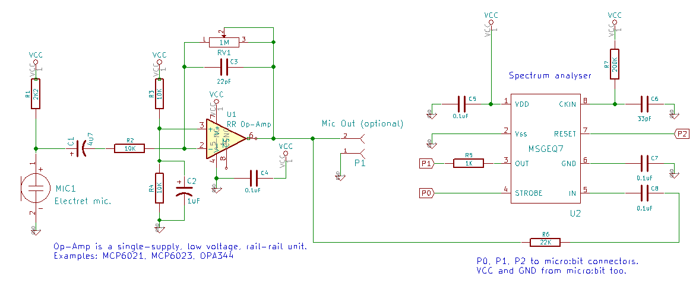

# micro-bit_spectrum
Code to display an audio spectrum bar chart on the BBC micro:bit using the MSGEQ7 spectrum analyser chip - circuit schematic as shown.

The prototype was breadboarded and then transferred to a zbit:builder board (kindly supplied by http://zbit-connect.co.uk/). Due to the limited prototyping space on the zbit:builder, less experienced constructors might find it easier to use regular stripboard.

