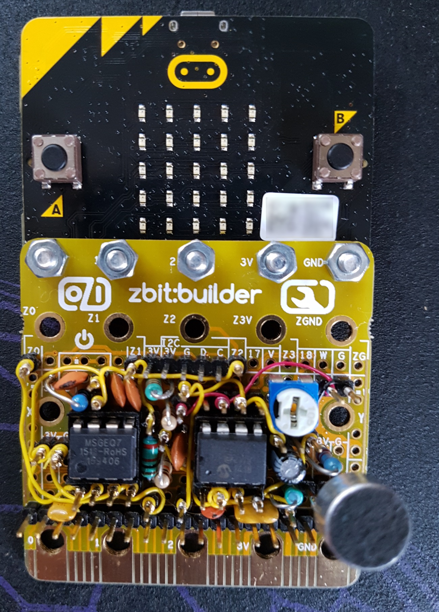

# micro-bit_spectrum
Code to display an audio spectrum bar chart on the BBC micro:bit using the MSGEQ7 spectrum analyser chip - circuit schematic as shown.

The prototype was breadboarded and then transferred to a zbit:builder board (kindly supplied by http://zbit-connect.co.uk/). Due to the limited prototyping space on the zbit:builder, less experienced constructors might find it easier to use regular stripboard.

Video here: https://youtu.be/wQXjX3phBOo

The MSGEQ7 chip is available from Sparkfun and regional/global agents. 

* https://www.sparkfun.com/products/10468
* https://www.sparkfun.com/datasheets/Components/General/MSGEQ7.pdf

Beware of buying the MSGEQ7 chip on ebay - some/many have turned out to be faulty and it's suspected that they are manufacturing rejects. 

*Schematic*

*On zbit:builder*

(That's some mighty [fine/scary - insert as appropriate] circuit squishing going on there.)
